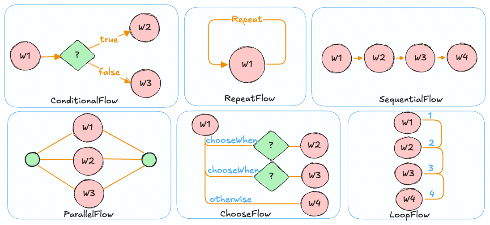
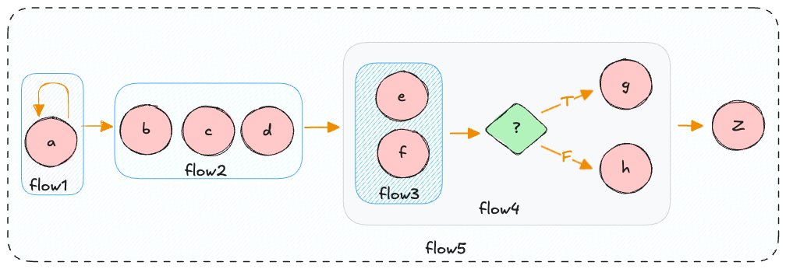
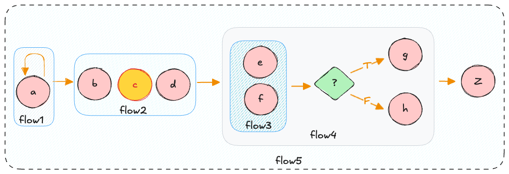

***

<div align="center">
    <b><em>Easy Work</em></b><br>
    基于Java&trade;的简单、易用、傻瓜式的工作流引擎
</div>

<div align="center">

</div>

***

📖 [English](../README.md) | 📖 中文

## Easy Work 是什么?

Easy Work 是一个用于 Java 的工作流引擎。它提供了简洁的 API 和 构建模块，便于创建和运行可组合的工作流。

在Easy Work中，工作单元由`Work`接口表示，工作流则由`WorkFlow`接口表示。Easy  Work 提供了 `WorkFlow` 接口的6种实现方式：

<p align="center">
    
</p>

这些是使用Easy Work创建工作流时所需了解的唯一基本流程。

你无需学习复杂的符号或概念，只需掌握几个易于理解的自然API即可。

## 如何使用 ？
首先，让我们创建一个 Work:

```java
public class PrintMessageWork implements Work {

    private final String message;

    public PrintMessageWork(String message) {
        this.message = message;
    }

    @Override
    public String execute(WorkContext workContext) {
        System.out.println(message);
        return message;
    }
}
```
此 Work 将指定消息打印至标准输出。现在假设我们想要创建如下工作流程：
1. 打印 a 三次
2. 顺序打印 b c d 
3. 并行执行 e f
4. 如果并行执行的结果成功，执行 g, 否则执行 h
5. 最后执行 z

此工作流程说明如下：
<p align="center">
    
</p>

* `flow1` 是一个 打印 a 的 `RepeatFlow`，连续执行三次
* `flow2` 是一个 依次打印 b c d 的 `SequentialFlow`， 按照顺序依次执行
* `flow3` 是一个 并行打印 e f 的 `ParallelFlow`， 同时执行
* `flow4` 是一个 基于条件判断的 `ConditionalFlow`，首先执行`flow3`，如果执行成功（状态为 COMPLETE）则执行 g，否则执行 h
* `flow5` 是一个 顺序执行流程 `SequentialFlow`，保证 顺序执行 `flow1` `flow2` `flow4`，最后执行 z

使用Easy Work，此工作流可以通过以下代码段实现：
```java
PrintMessageWork a = new PrintMessageWork("a");
PrintMessageWork b = new PrintMessageWork("b");
PrintMessageWork c = new PrintMessageWork("c");
PrintMessageWork d = new PrintMessageWork("d");
PrintMessageWork e = new PrintMessageWork("e");
PrintMessageWork f = new PrintMessageWork("f");
PrintMessageWork g = new PrintMessageWork("g");
PrintMessageWork h = new PrintMessageWork("h");
PrintMessageWork z = new PrintMessageWork("z");

WorkFlow flow = aNewSequentialFlow(
    aNewRepeatFlow(a).times(3),
    aNewSequentialFlow(b,c,d),
    aNewConditionalFlow(
        aNewParallelFlow(e,f).withAutoShutDown(true)
    ).when(
        WorkReportPredicate.COMPLETED,
        g,
        h
    ),
    z
);
aNewWorkFlowEngine().run(flow, new WorkContext());
```
## 暂停工作流
现在（从 v1.0.5开始）工作流支持 `断点`， 通过`断点` 你可以暂停执行工作流，做一些其他事情然后恢复执行工作流。

你可以在工作流的任何位置配置`断点`。

例如，你可以将断点设置在`c`工作单元上，然后恢复执行。

此工作流说明如下：
<p align="center">
    
</p>

此工作流可以通过以下代码段实现：
```java
SequentialFlow flow = aNewSequentialFlow(
    aNewRepeatFlow(a).times(3),
    aNewSequentialFlow(b,aNamePointWork(c).point("C_BREAK_POINT"),d),
    aNewConditionalFlow(
        aNewParallelFlow(e,f).withAutoShutDown(true)
    ).when(
        WorkReportPredicate.COMPLETED,
        g,
        h
    ),
    z
);
//执行到改断点并暂停
flow.execute("C_BREAK_POINT");
System.out.println("execute to the break point `C_BREAK_POINT`");
//从断点处继续执行，直到完成
flow.execute();
```
这不是一个非常有用的工作流，只是为了让你了解如何使用Easy Work而编写工作流。

## JSON构建工作流
从 V1.0.8开始工作流支持基于 `JSON` 的构建，你可以通过 `JSON` 的方式构建任意复杂的工作流。
基于以上图示中的例子，通过 JSON 构建工作流的片段为(example.json)：
```json
{
  "type": "sequential",
  "works": [{
    "type": "repeat",
    "times": 3,
    "work": {
      "type": "work.PrintMessageWork",
      "message": "a"
    }
  },{
    "type": "sequential",
    "works": [{
      "type": "work.PrintMessageWork",
      "message": "b"
    },{
      "type": "work.PrintMessageWork",
      "message": "c"
    },{
      "type": "work.PrintMessageWork",
      "message": "d"
    }]
  },{
      "type": "conditional",
      "decide": {
        "type": "parallel",
        "autoShutdown": true,
        "works": [{
          "type": "work.PrintMessageWork",
          "message": "e"
        },{
          "type": "work.PrintMessageWork",
          "message": "f"
        }]
      },
      "predicate": {
        "left" : "$status",
        "operator": "eq",
        "right": "COMPLETED"
      },
      "trueWork": {
        "type": "work.PrintMessageWork",
        "message": "g"
      },
      "falseWork": {
        "type": "work.PrintMessageWork",
        "message": "h"
      }
  }],
  "then": {
    "type": "work.PrintMessageWork",
    "message": "z"
  }
}
```
你可以通过以下代码反序列化工作流，并进行执行（更多例子请参考test/java/DeserializeTest)
```java
String json = ResourceReader.readJSON("json/example.json");
SequentialFlow sequentialFlow = (SequentialFlow) deserialize(json);
sequentialFlow.execute(new WorkContext());
```
## 序列化工作流为 JSON
 从 V1.0.9 开始 EasyWork 支持序列化为 `JSON`, 你可以在构建完工作流后，通过serialize()方法序列化为 `JSON`.
 根据上图所示的示例，您可以使用以下代码序列化为JSON（有关更多示例，请参阅test/java/serializeTest）：
```java
String json = ResourceReader.readJSON("json/example.json");
SequentialFlow sequentialFlow = (SequentialFlow) deserialize(json);
System.out.println(sequentialFlow.serialize());
```


你可以在 `test/java` 中 查看更多的测试用例。

更详细的信息，请参考 [WIKI](docs/WIKI.md)

## 许可证

Easy Work 基于 Apache License Version 2.0